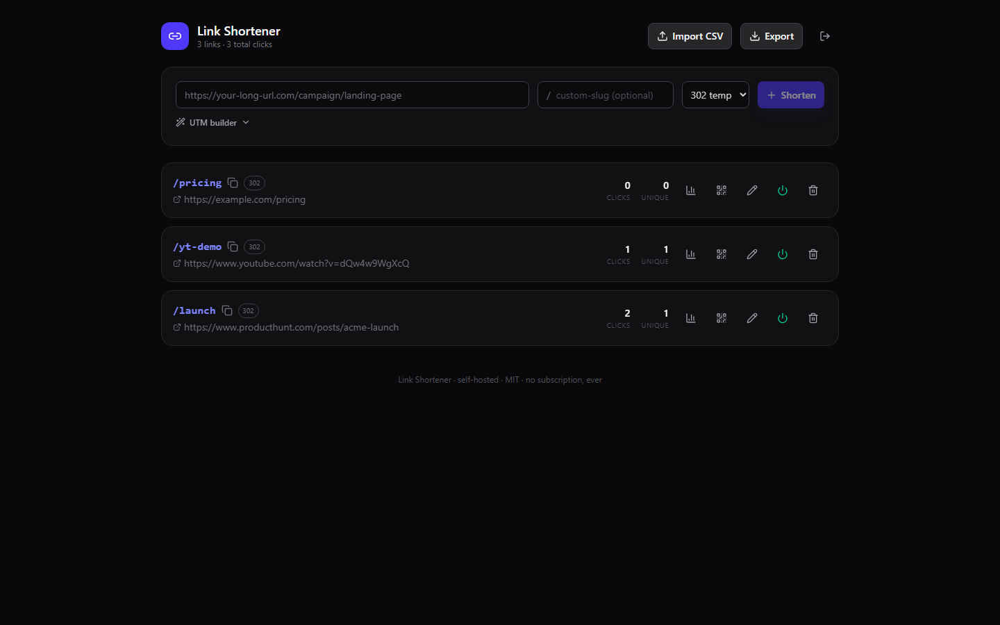

# Link Shortener


**Your own branded link shortener with full click analytics. Pay once. Own it forever. No subscription.**

Bitly charges **$348/year** just to use *your own domain* with your links — and your click data lives on their servers. Link Shortener runs on your $5 VPS (or right on your desktop), keeps every click in a local SQLite file you own, and never phones home.



## Features

- **Branded short links** — auto-generated or custom slugs on your own domain
- **Click analytics** — total + unique clicks (privacy-friendly daily IP+UA hash), clicks-over-time chart, top referrers, devices, browsers, and countries
- **QR code for every link** — downloadable PNG and SVG
- **301 / 302 per link** — SEO-permanent or trackable-temporary, your call
- **Enable / disable / edit** destinations any time without breaking printed QR codes
- **UTM builder** built into the create form — tag campaigns without a spreadsheet
- **Bulk CSV import & export** — migrate off Bitly in one paste
- **Country detection with zero paid APIs** — reads `CF-IPCountry` when behind Cloudflare (free tier works), degrades gracefully otherwise
- **100% local & private** — SQLite storage, no telemetry, no external calls
- **Two modes** — run it as a desktop app, or deploy to a $5 VPS when you need it public

## Quick start

```bash
npm i
npm run build     # build the React dashboard
npm start         # http://localhost:5302
```

Set your admin password first (copy `.env.example` to `.env` and change `ADMIN_PASSWORD`).

### Desktop mode

```bash
npm run desktop
```

Opens the same dashboard in an Electron window, auto-logged-in, with data stored in your user profile. Perfect for QR-code generation and local campaign planning; deploy the exact same code to a VPS when links need to be public.

### Docker

```bash
ADMIN_PASSWORD=supersecret docker compose up -d
```

The SQLite database persists in `./data`. Point your domain (e.g. `go.yourbrand.com`) at the server, and put free Cloudflare in front to get per-country analytics via the `CF-IPCountry` header.

## Configuration (`.env`)

| Variable | Default | Purpose |
| --- | --- | --- |
| `PORT` | `5302` | Server port |
| `ADMIN_PASSWORD` | `changeme` | Dashboard password — change it! |
| `BASE_URL` | *(request host)* | Public URL used in QR codes, e.g. `https://go.yourbrand.com` |
| `DEFAULT_REDIRECT_TYPE` | `302` | Default status for new links (301 or 302) |
| `DB_PATH` | `./data/links.db` | SQLite file location |

## Link Shortener vs Bitly

| | **Link Shortener** | Bitly |
| --- | --- | --- |
| Price | **$29 once** | $29/mo ($348/yr) for a custom domain |
| Your own domain | ✅ Included | Paid plans only |
| Links | Unlimited | Capped per plan |
| Click data ownership | ✅ Your SQLite file | Their servers |
| QR codes (PNG + SVG) | ✅ Included | Limited / paid tiers |
| Bulk CSV import/export | ✅ | Paid tiers |
| UTM builder | ✅ | ✅ |
| Tracking pixels / telemetry | ❌ None | Their business model |
| Works offline / on LAN | ✅ | ❌ |

## ☕ Skip the setup — get the 1-click installer

Don't want to touch a terminal? Grab the packaged one-click installer (plus updates and setup support) for a single one-time payment:

**[→ Get it on Whop](https://whop.com/onetime-suite)**

## Tech stack

- **Server:** Node 20+, Express, better-sqlite3 (WAL mode), qrcode, ua-parser-js
- **Dashboard:** React 19 + Vite, Tailwind CSS 4, Lucide icons, Framer Motion
- **Desktop:** thin Electron wrapper around the same server (electron-builder NSIS config included)
- **Tests:** `npm test` boots the real server and exercises redirect, logging, analytics, QR, and CSV end to end

## API (everything the dashboard uses)

All admin endpoints require the session cookie from `POST /api/login`.

| Method & path | Purpose |
| --- | --- |
| `POST /api/login` `{password}` | Get session cookie |
| `GET /api/links` | List links with click counts |
| `POST /api/links` `{destination, slug?, redirect_type?}` | Create link |
| `PUT /api/links/:id` | Edit destination / slug / redirect type / enabled |
| `DELETE /api/links/:id` | Delete link + its clicks |
| `GET /api/links/:id/analytics?days=30` | Totals, uniques, series, referrers, devices, browsers, countries |
| `GET /api/links/:id/qr?format=svg` | QR code (PNG default, SVG optional) |
| `GET /api/export.csv` / `POST /api/import` | Bulk CSV out / in |
| `GET /:slug` | The redirect itself (logs the click) |

## License

MIT © 2026 Ben ([bensblueprints](https://github.com/bensblueprints))
